## Examples

<p align="center">
  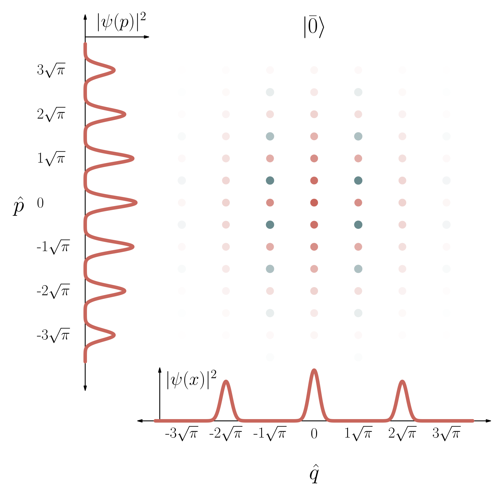<br>
  <sub>GKP state Wigner function with Gaussian envelope</sub>
</p>

<p align="center">
  <br>
  <sub>Noise channel</sub>
</p>

<p align="center">
  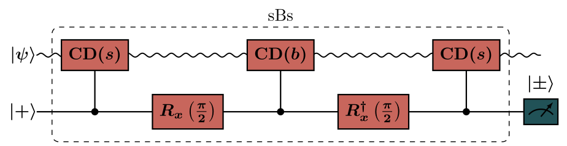<br>
  <sub>sBs stabilization circuit</sub>
</p>

<p align="center">
  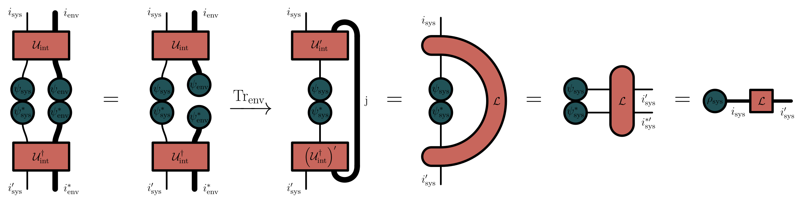<br>
  <sub>Superoperator as a tensor network</sub>
</p>

<p align="center">
  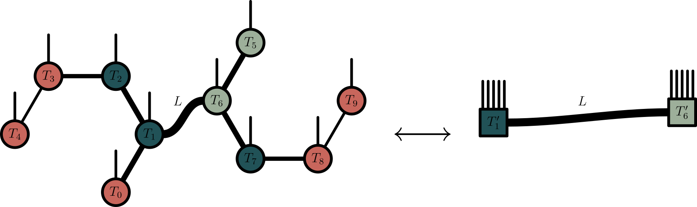<br>
  <sub>Tensor-network coarse-graining</sub>
</p>

<p align="center">
  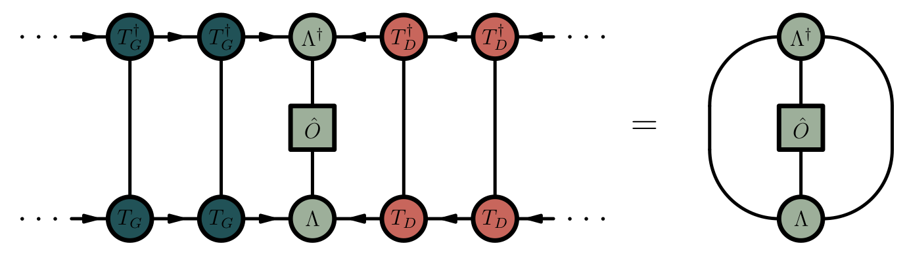<br>
  <sub>MPS orthogonality center</sub>
</p>

<p align="center">
  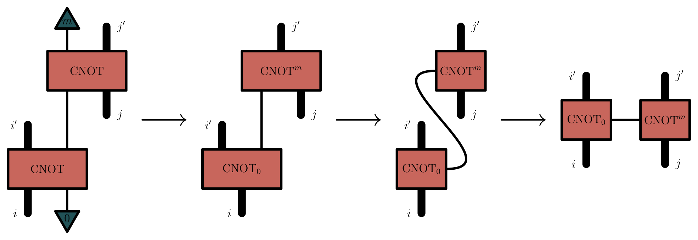<br>
  <sub>Parity-check stabilizer network</sub>
</p>

<p align="center">
  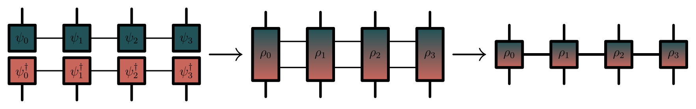<br>
  <sub>Density matrix as an MPO</sub>
</p>

The same figure (`noise_channel`) rendered with four different color themes:

<table align="center">
  <tr>
    <td align="center">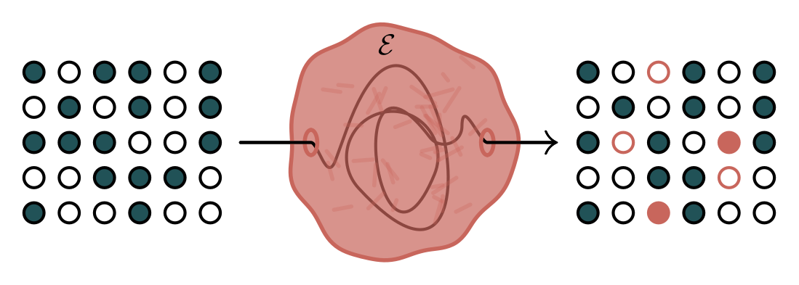<br><sub><code>royer_lab_main</code></sub></td>
    <td align="center">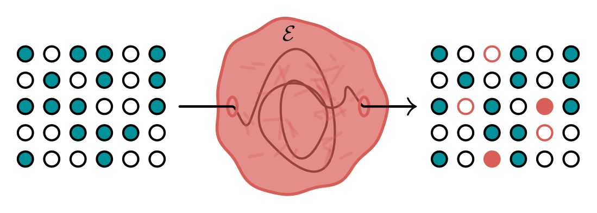<br><sub><code>memoire_JB</code></sub></td>
  </tr>
  <tr>
    <td align="center">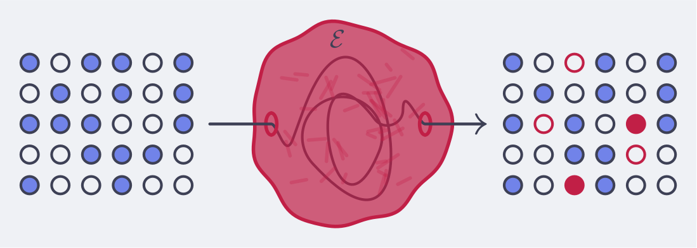<br><sub><code>catppuccin_latte</code></sub></td>
    <td align="center">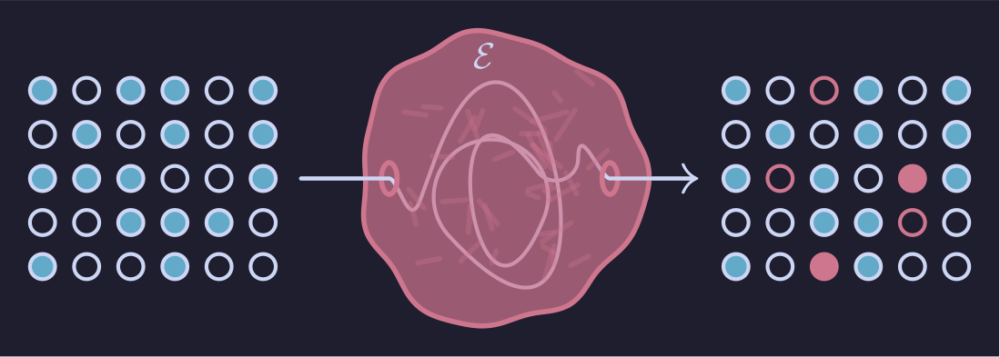<br><sub><code>catppuccin_mocha</code></sub></td>
  </tr>
</table>

# memoire_figures

> **English version follows** — [English](#english-version).

Figures faîtes pour le mémoire de Jean-Baptiste Bertrand. Chaque figure est
générée à partir de sa source (Asymptote, LaTeX/quantikz ou
Python/matplotlib+QuTiP) et recolorée à partir d'un seul **thème de couleurs**,
afin que l'ensemble des figures demeure visuellement cohérent.

## Prérequis

Les éléments suivants doivent se trouver dans votre `PATH` :

- `make`
- `python3` (3.10+)
- `asy` (Asymptote) — pour les figures de diagrammes (optionnel)
- `lualatex` avec les paquets `quantikz`/`tikz`/`physics` — pour les figures de
  circuits (optionnel)
- Une installation LaTeX fonctionnelle avec `pdflatex` (matplotlib s'en sert
  pour le rendu du texte) (optionnel)

Ceux marqués « optionnel » ne sont nécessaires que pour certaines figures.

L'environnement Python est créé automatiquement : les dépendances (matplotlib,
numpy, scipy, qutip, …) sont installées dans un `.venv/` local lors de la
première construction — **pas besoin d'installer les dépendances manuellement**.
Les versions épinglées se trouvent dans `requirements.txt`.

## Démarrage rapide

```bash
make                 # construit toutes les figures avec le thème par défaut
make THEME=catppuccin_latte # construit toutes les figures avec le thème « catppuccin_latte »
make list-themes     # liste les thèmes disponibles
make help            # affiche toutes les cibles
```

La première exécution crée `.venv/` et `colors.json` ; elle prend un certain
temps (QuTiP est volumineux). Les exécutions suivantes ne reconstruisent que ce
qui a changé.

## Thèmes de couleurs

Un thème est un petit fichier JSON dans `themes/` qui associe des noms de
couleurs sémantiques à des valeurs hexadécimales :

```json
{
  "primary": "#009199",
  "secondary": "#D75F57",
  "tertiary": "#9DAF9A",
  "mainred": "#D75F57",
  "mainblue": "#009199",
  "error": "#d81d04",
  "background": "#ffffff",
  "textcolor": "#000000"
}
```

Pour ajouter le vôtre, il suffit de déposer un fichier JSON contenant tous les
champs ci-haut !

Le thème **actif** est celui qui est présentement copié dans `./colors.json`
(géré par le Makefile). Construire avec `make THEME=<nom>` copie
`themes/<nom>.json` par-dessus `colors.json`, régénère les fichiers de couleurs
dérivés et reconstruit tout ce qui est touché.

## Reconstruire des figures individuelles

Les figures sont des cibles Make ordinaires nommées d'après leur fichier de
sortie PDF/PNG. Construisez-en une seule — pratique lorsque vous ne voulez
ajuster qu'une figure ou l'essayer dans un autre thème :

```bash
make figs/TNs/ex.pdf
make figs/heatmaps/heatmap_exemple.pdf
make figs/graphs/graph_exemple.pdf THEME=catppuccin_mocha
```

Modifiez n'importe quel fichier source (`.asy`, `.tex`, un script de tracé
`.py`, ou les données `.dat`/`.csv` sous-jacentes) et relancez `make` : seules
les figures qui dépendent de ce que vous avez changé sont reconstruites. Changer
de thème force un recoloriage complet.

### Cibles de groupe

| cible      | construit                                      |
| ---------- | ---------------------------------------------- |
| `asy`      | tous les diagrammes Asymptote                  |
| `tex`      | tous les circuits LaTeX/quantikz               |
| `states`   | tous les tracés de fonctions de Wigner (QuTiP) |
| `heatmaps` | la heatmap d'exemple (canal de Pauli)          |
| `graphs`   | le graphique d'exemple (courbes simples)       |

## Comment fonctionne le coloriage

`scripts/convert_json.py` lit `colors.json` et produit deux fichiers dérivés que
les sources de figures utilisent :

- `AutoColors.sty.tmp` — bloc LaTeX de `\definecolor`, inclus via `\input` par
  `figs/quantikz_head.sty` (utilisé par les figures de circuits `.tex`).
- `figs/AutoColors.asy.tmp` — définitions de `pen` Asymptote, incluses via
  `include` par chaque figure `.asy`.

Les scripts de tracé Python lisent `colors.json` directement. Les trois chemins
proviennent du même thème, donc un seul `colors.json` pilote l'ensemble des
figures.

## Comment sont faites les figures de réseaux de tenseurs

Les diagrammes de réseaux de tenseurs (`figs/TNs/`) ne sont pas dessinés trait
par trait : ils s'appuient sur la bibliothèque Asymptote partagée
[`figs/TN.asy`](figs/TN.asy), qui offre une interface **déclarative**. On décrit
des tenseurs (nœuds) et leurs pattes (indices nommés) ; les indices répétés sont
contractés automatiquement, les indices libres restent pendants, et l'épaisseur
des arêtes encode la dimension des indices. Voir le
[README détaillé de la section TN](figs/TNs/README.md) pour les objets définis
et leurs propriétés.

## Nettoyage

```bash
make clean       # supprime les déchets LaTeX/asy et les caches de couleurs générés
make cleanfigs   # supprime toutes les sorties de figures générées
make distclean   # cleanfigs + clean + supprime .venv et colors.json
```

## Structure

```
memoire_figures/
├── Makefile              # règles de construction + sélection du thème
├── requirements.txt      # dépendances Python épinglées (auto-installées dans .venv/)
├── colors.json           # thème actif (généré ; ne pas modifier à la main)
├── themes/               # thèmes de couleurs — ajoutez le vôtre ici
│   ├── royer_lab_main.json             # défaut du labo, contraste élevé (défini via DEFAULT_THEME)
│   ├── royer_lab_bas_contraste.json    # thème du lab royer, bas contraste (fond crème, contraste doux)
│   ├── memoire_JB.json
│   ├── joker.json
│   ├── catppuccin_latte.json
│   └── catppuccin_mocha.json
├── scripts/
│   └── convert_json.py   # colors.json -> fichiers de couleurs LaTeX/Asymptote
└── figs/                 # toutes les sources de figures, groupées par type
    ├── *.asy             # diagrammes Asymptote autonomes
    ├── *.tex             # diagrammes de circuits quantikz
    ├── TN.asy            # bibliothèque partagée de dessin de réseaux de tenseurs
    ├── quantikz_head.sty # préambule LaTeX partagé pour les circuits
    ├── TNs/              # diagrammes de réseaux de tenseurs (Asymptote)
    ├── states/           # fonctions de Wigner (QuTiP, à partir de .dat)
    ├── heatmaps/         # heatmap d'exemple de canal de Pauli (plot.py + heatmap_exemple.dat)
    └── graphs/           # graphique d'exemple (make_plot.py + graph_exemple.dat)
```

## Licence

Ce projet est sous licence **Creative Commons Attribution-ShareAlike 4.0
International (CC BY-SA 4.0)**. Vous êtes libre de l'utiliser, de le partager et
de le modifier — même à des fins commerciales — à condition de :

- **créditer** Jean-Baptiste Bertrand (attribution) ;
- **partager** toute version modifiée sous la **même licence** (les figures
  doivent donc rester ouvertes).

Le texte complet de la licence se trouve dans le fichier [`LICENSE`](LICENSE).

---

<a name="english-version"></a>

# memoire_figures (English version)

Figures made for Jean-Baptiste Bertrand's master thesis. Every figure is
generated from source (Asymptote, LaTeX/quantikz, or Python/matplotlib+QuTiP)
and is recolored from a single **color theme** so the whole figure set stays
visually consistent.

## Requirements

These must be on your `PATH`:

- `make`
- `python3` (3.10+)
- `asy` (Asymptote) — for the diagram figures (optional)
- `lualatex` with the `quantikz`/`tikz`/`physics` packages — for the circuit
  figures (optional)
- A working LaTeX install with `pdflatex` (matplotlib uses it for text
  rendering) (optional)

Those marked "optional" are only needed for certain figures.

The Python environment is created automatically: the dependencies (matplotlib,
numpy, scipy, qutip, …) are installed into a local `.venv/` the first time you
build — **no need to install dependencies by hand**. Pinned versions live in
`requirements.txt`.

## Quick start

```bash
make                 # build every figure with the default theme
make THEME=catppuccin_latte # build every figure with the "catppuccin_latte" theme
make list-themes     # list the available themes
make help            # show all targets
```

The first run creates `.venv/` and `colors.json`; it takes a while (QuTiP is
large). Subsequent runs only rebuild what changed.

## Color themes

A theme is a small JSON file in `themes/` mapping semantic color names to hex
values:

```json
{
  "primary": "#009199",
  "secondary": "#D75F57",
  "tertiary": "#9DAF9A",
  "mainred": "#D75F57",
  "mainblue": "#009199",
  "error": "#d81d04",
  "background": "#ffffff",
  "textcolor": "#000000"
}
```

To add your own, just drop a JSON file with all the fields above!

The **active** theme is whatever is currently copied to `./colors.json` (managed
by the Makefile). Building with `make THEME=<name>` copies `themes/<name>.json`
over `colors.json`, regenerates the derived color files, and rebuilds anything
affected.

## Rebuilding individual figures

Figures are normal Make targets named after their output PDF/PNG. Build just one
— handy when you only want to tweak a single figure or try it in another theme:

```bash
make figs/TNs/ex.pdf
make figs/heatmaps/heatmap_exemple.pdf
make figs/graphs/graph_exemple.pdf THEME=catppuccin_mocha
```

Edit any source file (`.asy`, `.tex`, or a `.py` plotting script, or the
underlying `.dat`/`.csv` data) and re-run `make`: only the figures that depend
on what you changed are rebuilt. Switching themes forces a full recolor.

### Group targets

| target     | builds                              |
| ---------- | ----------------------------------- |
| `asy`      | all Asymptote diagrams              |
| `tex`      | all LaTeX/quantikz circuits         |
| `states`   | all Wigner-function plots (QuTiP)   |
| `heatmaps` | the example heatmap (Pauli channel) |
| `graphs`   | the example graph (simple curves)   |

## How the coloring works

`scripts/convert_json.py` reads `colors.json` and emits two derived files that
the figure sources consume:

- `AutoColors.sty.tmp` — LaTeX `\definecolor` block, `\input` by
  `figs/quantikz_head.sty` (used by the `.tex` circuit figures).
- `figs/AutoColors.asy.tmp` — Asymptote `pen` definitions, `include`d by every
  `.asy` figure.

The Python plotting scripts read `colors.json` directly. All three paths come
from the same theme, so one `colors.json` drives the entire figure set.

## How the tensor-network figures are made

The tensor-network diagrams (`figs/TNs/`) are not drawn stroke by stroke: they
rely on the shared Asymptote library [`figs/TN.asy`](figs/TN.asy), which exposes
a **declarative** interface. You describe tensors (nodes) and their legs (named
indices); repeated indices are contracted automatically, free indices are left
dangling, and edge thickness encodes index dimension. See the
[detailed TN-section README](figs/TNs/README.md) for the objects defined and
their properties.

## Cleaning

```bash
make clean       # remove LaTeX/asy junk and the generated color caches
make cleanfigs   # remove all generated figure outputs
make distclean   # cleanfigs + clean + remove .venv and colors.json
```

## Layout

```
memoire_figures/
├── Makefile              # build rules + theme selection
├── requirements.txt      # pinned Python deps (auto-installed into .venv/)
├── colors.json           # active theme (generated; do not edit by hand)
├── themes/               # color themes — add yours here
│   ├── royer_lab_main.json             # lab default, high contrast (set via DEFAULT_THEME)
│   ├── royer_lab_bas_contraste.json    # royer lab theme, low contrast (cream background, soft contrast)
│   ├── memoire_JB.json
│   ├── joker.json
│   ├── catppuccin_latte.json
│   └── catppuccin_mocha.json
├── scripts/
│   └── convert_json.py   # colors.json -> LaTeX/Asymptote color files
└── figs/                 # all figure sources, grouped by type
    ├── *.asy             # standalone Asymptote diagrams
    ├── *.tex             # quantikz circuit diagrams
    ├── TN.asy            # shared tensor-network drawing library
    ├── quantikz_head.sty # shared LaTeX preamble for circuits
    ├── TNs/              # tensor-network diagrams (Asymptote)
    ├── states/           # Wigner functions (QuTiP, from .dat)
    ├── heatmaps/         # example Pauli-channel heatmap (plot.py + heatmap_exemple.dat)
    └── graphs/           # example graph (make_plot.py + graph_exemple.dat)
```

## License

This project is licensed under the **Creative Commons Attribution-ShareAlike 4.0
International (CC BY-SA 4.0)** license. You are free to use, share, and adapt it
— even commercially — as long as you:

- **credit** Jean-Baptiste Bertrand (attribution); and
- **share** any modified version under the **same license** (so the figures stay
  open).

The full license text is in the [`LICENSE`](LICENSE) file.
